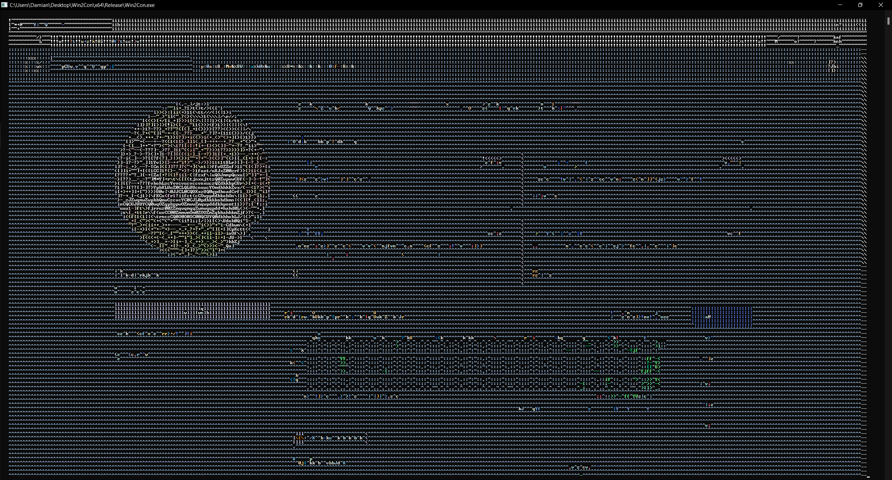
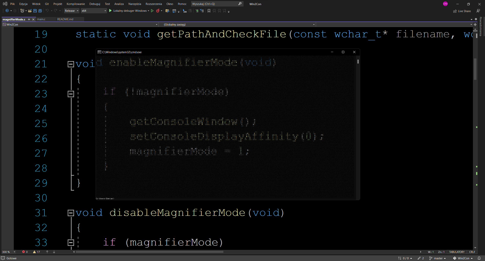

# Win2Con
Displays windows and allows you to use them in console.

Lots of source code copied from my previous project - [ConPlayer](https://github.com/mt1006/ConPlayer)

[Download Version 1.1](https://github.com/mt1006/Win2Con/releases/tag/Win2Con-1.1)

Demonstration: https://www.youtube.com/watch?v=iPb93gAq2_M

# Examples

Minecraft in cmd [```-ca -tm```]


Browser in cmd [```-tm```]



Magnifier mode [```-m -sm soft-fill -sch -c cstd-rgb -r 50```]



# List of basic options
```
 [none] / -i         Handle to input window (in hexadecimal).
  [handle]           When used, it will skip window selection menu.
                     Examples:
                      win2con 000100F8
 -c [mode]           Sets color mode.
  (--colors)         Default color mode is "cstd-256".
                     To get list of all avaible color modes use "win2con -h color-modes".
                     Examples:
                      win2con -c winapi-16
 -s [w] [h]          Sets width and height of the drawn image.
  (--size)           By default size of entire window.
                     Using "-s 0 0" image size will be constant.
                     (will not change with the console size change).
                     Examples:
                      win2con -s 120 50
 -sm [mode] [...]    Sets scaling mode.
  (--scaling-mode)   Default scaling mode is "fill" with enabled keeping ratio.
                     To get list of all avaible scaling modes use "win2con -h scaling-modes".
                     Examples:
                      win2con -sm no-scaling
 -ca (--client-area) Gets only window client area (without title bar or menu).
                     It may not work properly in some cases!
 -tm (--top-most)    Places console window above all other windows.
                     and makes it transparent to input.
                     Doesn't work with Windows Terminal!
 -m (--magnifier)    Enables "magnifier mode".
                     Instead of drawing one window, Win2Con will draw area under console.
                     Requires Windows 10 Version 2004 (20H1) [10.0.19041] or higher!
 -inf(--information) Information about Win2Con.
 -v  (--version)     Information about Win2Con version.
 -h <topic>          Displays help message.
  (--help)           Topics: basic, advanced, color-modes, scaling-modes, keyboard, full
  
[To see full help use "win2con -h full"]
 ```

# Keyboard control
```
[Right Alt + ...]:
 Q - Exit from window
 X - Exit from Win2Con
 C - Switch: entire window/client area
 T - Switch: console window above all other windows
```

# Compiling

## Windows
To compile it on Windows you need only Visual Studio. Just open .sln file and everything should work (at least theoretically).
